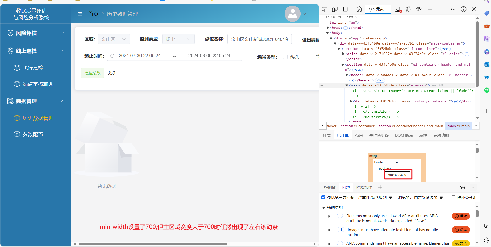
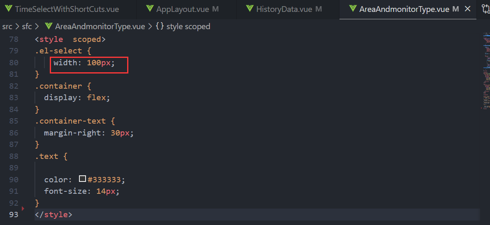

## min-width设置了700,但主区域宽度大于700时任然出现了左右滚动条

定位： 是上方的card组件固定宽度，导致以它的宽度为最小宽度，所以导致出现了滚动条。
解决： 将card组件宽度设置为弹性宽度

查看card组件，本身并没有社会固定宽度，审查组件，发现每个小组件设置了固定宽度，导致多个小组件并列组合起来，宽度就很大

目前小组件的固定宽度已经是最小了，如果设置的更小，会导致出现组件变形的情况。那么，小组件的宽度怎么设置最合适？

都设置成100%，组合的时候给予珊瑯分割

响应式设计：指的是一个响应浏览环境的网页或者应用设计

视口、媒体查询、流式布局、弹性布局、流式图片和rem适配布局等关键技术，

1.媒体查询，以及样式改变时的点，被叫做断点（breakpoints）。
引入方式： 内部方式引入和外链式
~~~
@media mediatype and|not|only (media feature){
选择器{
属性名:属性值
}
}

2.灵活网格
`例如如果一行随着屏幕大小增加而增长得不可读的长，或者是一个盒子在变窄时把每行的两个单词挤到一起`。使用灵活网格，你只需要加进去一个断点，在内容看起来不齐整的时候改变设计

2.1 早年间进行响应式设计的时候，我们唯一的实现布局的选项是使用float。灵活浮动布局是这样实现的，让每个元素都有一个作为宽度的百分数，而且确保整个布局的和不会超过 100%。

2.2 布局的法则，通过使用像素并把布局转化为百分数 ：target / context = result
如果我们的预期栏尺寸为 60 像素，而且它所在的上下文（或者容器）为 960 像素
~~~
.col {
  width: 6.25%;    /* 60 / 960 = 0.0625 */
}

3.现代布局方式
如 多栏布局、伸缩盒和网格
3.1 多个列
指定column-count，这意指你希望把你的内容分成多少列。浏览器之后会算出这些列的大小，这是一个随着屏幕尺寸变化的尺寸。
~~~
.container {
  column-count: 3;
}

指定column-width的话，你是在指定一个最小宽度。浏览器会尽可能多数量地创建这一宽度的列，只要它们可以恰当地放进容器里面，然后将所有列之间的剩余空间共享出去
~~~
.container {
  column-width: 10em;
}
3.2 伸缩盒
在伸缩盒中，初始的行为是，弹性的物件将参照容器里面的空间的大小，缩小和分布物件之间的空间。通过更改flex-grow和 flex-shrink的值
~~~
.container {
  display: flex;
}

.item {
  flex: 1;
}
3.3 CSS网格
fr单位许可了跨网格轨道可用空间的分布
~~~
这会创建三个列轨道，每个占据了容器中可用空间的一部分
.container {
  display: grid;
  grid-template-columns: 1fr 1fr 1fr;
}

4.响应式图像
最简单的处理响应式图像的方式;
~~~
基本来说，你可以用一张有着所需最大尺寸的图像。然后缩放它
img {
  max-width: 100%;
}
这种方式有显然的弊端。
(1)图像有可能会显示得比它的原始尺寸小很多，以至于浪费带宽——一个移动端用户会下载几倍于他们在浏览器窗口中实际看到的大小的图像。
(2)你可能不想在移动端和桌面端有相同的图像宽高比例.例如，在移动端，方形图像的表现会很好，但是在桌面端显示同样的内容则应用宽图像。
这两个问题,不能简单通过缩放图像解决。

4.1 `响应式图像使用了<picture>元素和 srcset和sizes 特性`,解决这两个问题
4.2 流式图片
即采用百分比宽度的方式，如img{max-width:100%; height:auto}，使图片能够根据设备或屏幕大小实现自适应。

5. 响应式排版
5.1使用 rem
描述了根据屏幕真实使用范围的多少，在媒体查询的同时改变字体大小。
~~~
html {
  font-size: 1em;
}

h1 {
  font-size: 2rem;
}

@media (min-width: 1200px) {
  h1 {
    font-size: 4rem;
  }
}

5.2使用视口单位
永远都不要`只用 `vw单位设定文本。因为会失去了放缩任何使用vw单位的文本的能力
~~~
h1 {
  font-size: 6vw;
}

使用cal()，可解决上面的问题。将vw单位加到了使用固定大小（例如em或者rem）的值组，那么文本仍然是可放缩的。基本来说，是vw加在了放缩后的值上。
~~~
h1 {
  font-size: calc(1.5rem + 3vw);
}

6.视口元标签
~~~
<meta name="viewport" content="width=device-width,initial-scale=1" />

为何需要这个？因为移动端浏览器倾向于在它们的视口宽度上说谎。

由于原来 iPhone 发布以后，人们开始在小的手机屏幕上阅览网页，而大多数站点未对移动端做优化的缘故。`移动端浏览器因此会把视口宽度设为 960 像素`，而移动端浏览器真实的视口宽度可能为480像素。这会导致你的带断点和媒介查询的响应式设计不会在移动端浏览器上像预期那样工作。
所以通过设定width=device-width，你用设备的实际宽度覆写了苹果默认的width=960px，然后你的媒介查询就会像预期那样生效。